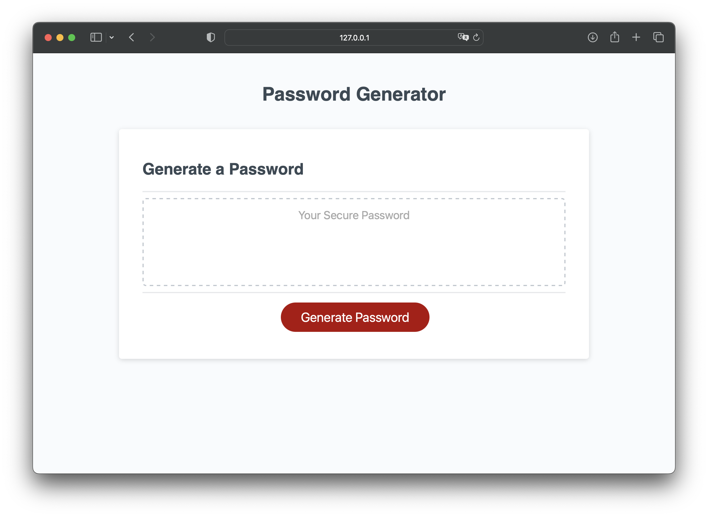
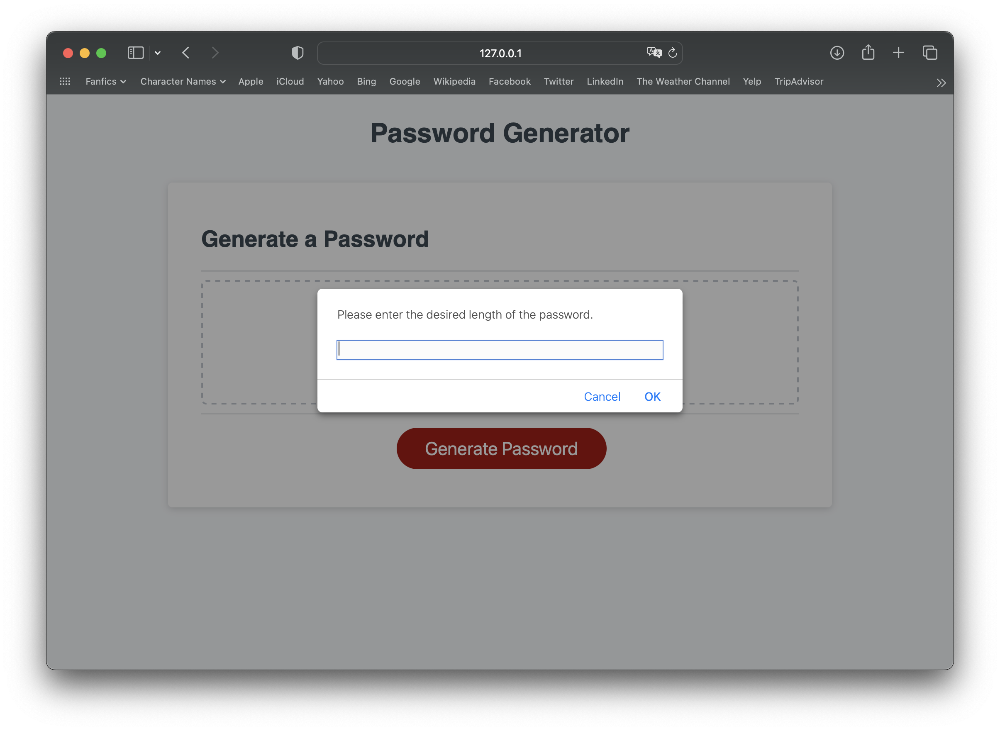
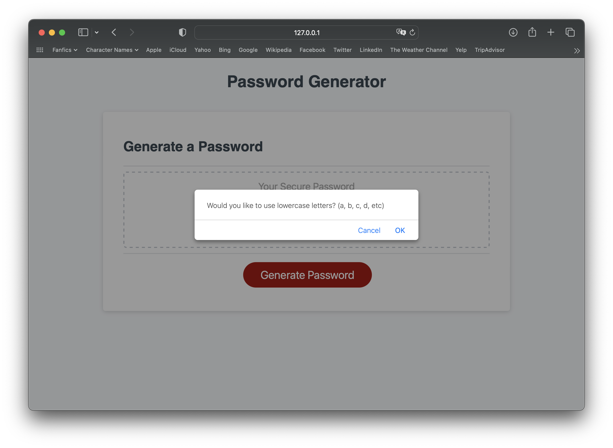
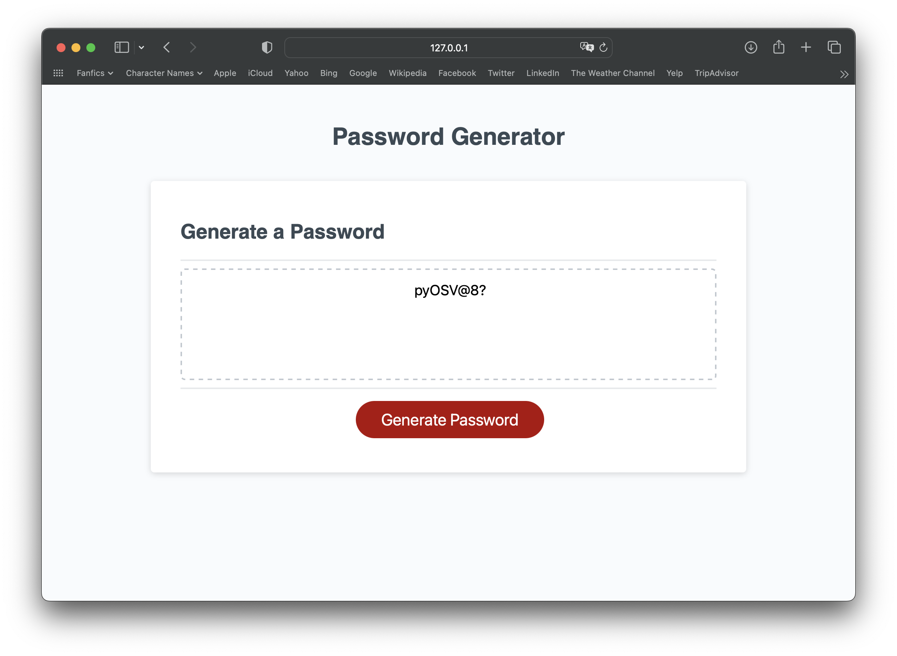

# Password Generator

## Description
This website allows people looking for a safe and secure passcode to receive a randomly generated password for their use. After responding to a few prompts in regards to password length, and character types to be included, users will receive their password and can use it as they wish.

## Installation
This webpage is accessible at https://liz-nino64.github.io/Password-Generator/

## License
Licensed under the MIT License
